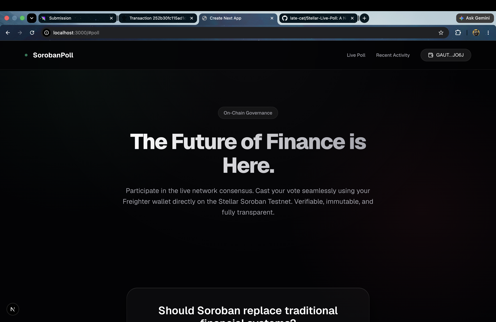
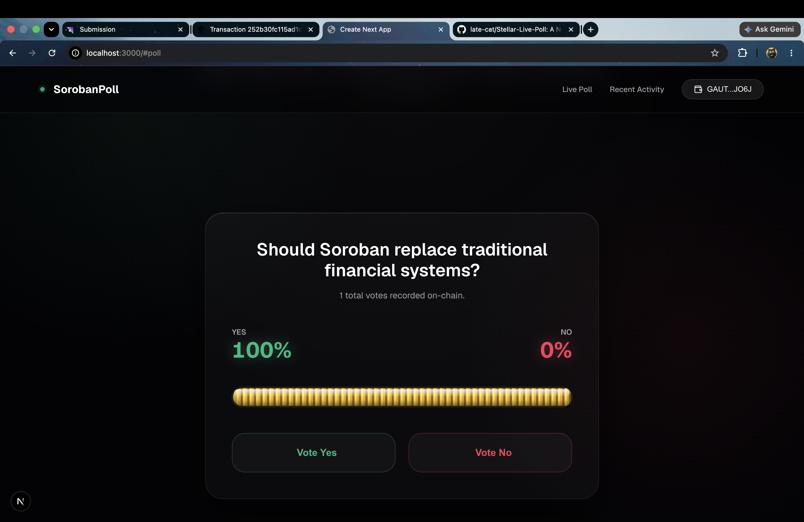
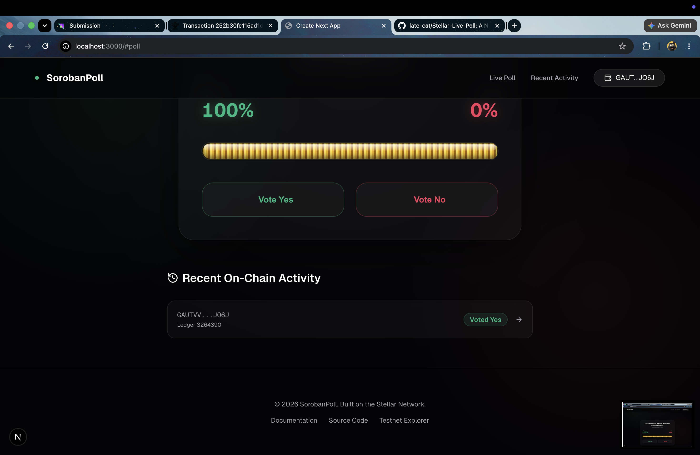

<div align="center">
  
  
  <h1 align="center">Stellar Live Poll</h1>
  
  <p align="center">
    <strong>A decentralized real-time polling application powered by Soroban Smart Contracts.</strong>
  </p>

  <p align="center">
    <a href="#challenge-requirements-fulfilled">White Belt Challenge Submission</a> •
    <a href="#smart-contract-information">View Contract</a> •
    <a href="#local-setup-instructions">Get Started</a>
  </p>
</div>

---

## Project Description

Stellar Live Poll is a modern, decentralized real-time polling application built to demonstrate the capabilities of the Stellar network. By combining Next.js with a Soroban Smart Contract deployed on the Stellar Testnet, users can seamlessly connect their Freighter wallets, cast immutable votes on-chain, and watch poll results update automatically in real time with fluid animations.

## Key Features

- **Multi-wallet Integration:** Securely connect and manage sessions using `@creit.tech/stellar-wallets-kit`.
- **On-chain Voting:** Votes are cast directly on the Stellar Testnet via a custom Soroban smart contract.
- **Real-time Synchronization:** Poll results are instantly fetched and rendered, providing immediate feedback.
- **Premium UX/UI:** Fluid result visualization and micro-interactions powered by Framer Motion and Tailwind CSS.
- **Transaction Flow:** End-to-end transparent transaction signing, submission, and confirmation.

## Challenge Requirements Fulfilled

This project serves as a comprehensive submission for the Stellar White Belt challenge, fulfilling all core criteria:

- [x] **Multi-wallet Integration:** Connected via Stellar Wallets Kit.
- [x] **Smart Contract Deployment:** Custom Soroban contract deployed to Testnet.
- [x] **Contract Interaction:** Frontend seamlessly calls contract functions to cast votes.
- [x] **Transaction Status Visibility:** Toasts and activity feeds display on-chain success or failure.
- [x] **Meaningful Commit History:** Clean, professional development history mirroring real-world workflows.
- [x] **Comprehensive Error Handling:** Graceful fallback for rejections, missing wallets, and balance issues.

## Visual Walkthrough

### Connecting Wallet


### Casting a Vote


### On-Chain Transaction Success


## Architecture Overview

The application utilizes a robust client-serverless architecture:
1. **Frontend Layer (Next.js):** Manages local state, animation, and UI rendering.
2. **Integration Layer (Stellar SDK):** Handles contract parsing, XDR encoding, and wallet connection payloads.
3. **Smart Contract Layer (Soroban):** Acts as the immutable backend, permanently storing the total votes and distribution logic on the Stellar blockchain.

## Smart Contract Information

The live poll is driven by a decentralized smart contract on the test network:

| Property | Value |
| :--- | :--- |
| **Network** | Stellar Testnet |
| **Contract Address** | `CBUJH3VFKIKCAKJYIMEUWI4QOPSOBGUC6NESL7K6U6K7PGHTO323HYRS` |
| **Environment** | Soroban Environment |

## Project Structure

```text
stellar-live-poll/
├── src/
│   ├── app/           # Next.js App Router and main pages
│   ├── components/    # Reusable modular React components
│   └── lib/           # Stellar SDK integration and constants
├── contracts/         # Soroban Rust smart contract source code
├── public/            # Static assets and icons
├── demo/img/          # Documentation and walkthrough imagery
└── package.json       # Project dependencies and scripts
```

## Local Setup Instructions

To run this application locally, ensure you have Node.js installed, then execute the following commands:

```bash
# Install all dependencies
npm install

# Start the development server
npm run dev
```
Navigate to `http://localhost:3000` to interact with the application.

## Technology Stack

- **Framework:** Next.js (React)
- **Language:** TypeScript, Rust (Contracts)
- **Styling:** Tailwind CSS, Vanilla CSS Modules
- **Animation:** Framer Motion
- **Web3 Integration:** Stellar Wallets Kit, Soroban SDK
- **Network:** Stellar Testnet

## Error Handling

The application has been engineered to handle critical edge cases gracefully:

1. **Wallet Not Installed:** Detects missing wallet extensions and prompts the user to install Freighter.
2. **User Rejects Transaction:** Safely catches `User declined` errors without breaking the application state.
3. **Insufficient Balance:** Specifically captures and notifies users of `tx_insufficient_balance` when attempting to cast a vote without Testnet XLM.

## Real-Time Synchronization

Instead of requiring manual page refreshes, the application actively polls the Soroban contract state after a successful vote transaction. When the blockchain ledger closes, the UI immediately calculates the new percentage distributions and fluidly animates the progress bars to reflect the newly synchronized on-chain reality.

## Deployment Information

This project is optimized for deployment on Vercel or any standard Node.js hosting environment. The Smart Contract is already live on the Stellar Testnet, meaning the frontend can be hosted fully statically without requiring a custom backend.

## Future Improvements

- **Mainnet Migration:** Transition the contract from Testnet to the Stellar Public Network.
- **Multiple Polls:** Expand the smart contract to support dynamic creation of multiple simultaneous polls.
- **Wallet Abstraction:** Implement Passkey wallets for a Web2-like onboarding experience.

## License

This project is open-source and available under the [MIT License](LICENSE).
